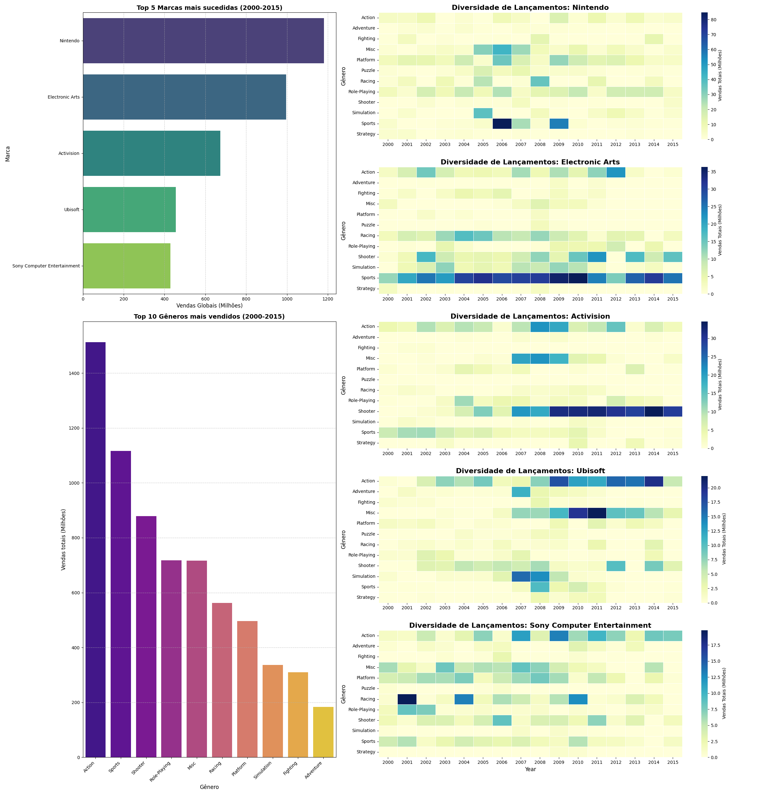

# Relatório
<!-- 
> [!CAUTION]
>
> - Você <ins>**não pode utilizar ferramentas de IA para escrever este relatório**</ins>. -->

## Identificação

- **Nome**: Pedro Henrique Moreira de Andrade Jacinto
- **Cartão UFRGS:** 00587135
## Dados utilizados
<!-- 
> [!IMPORTANT]
>
> - Os dados utilizados devem ser informados como **links** para as fontes originais.
> - Se houver mais de um conjunto de dados, liste todos separadamente.
> - Para cada conjunto de dados, inclua também uma **descrição curta** explicando os dados. -->

1. **Dataset 1**: https://www.kaggle.com/datasets/gregorut/videogamesales
    * **Descrição curta**: Este dataset contem dados sobre vendas de video games entre os anos de 1980 e 2020. Dentre as colunas disponiveis destaca-se 'Genre', 'Publisher' e 'Global Sales'

## Código-fonte da visualização
<!-- 
> [!IMPORTANT]
>
> - Indique abaixo onde está, dentro deste repositório, o código-fonte usado para gerar a visualização. -->

- **Arquivo principal**: <mark>`<preencher>`</mark>

## Imagem da visualização gerada

<!-- > [!IMPORTANT]
>
> - Insira aqui uma imagem da visualização criada por você. Troque `imagem-da-visualizacao.png` pelo caminho correto do arquivo no repositório. 
> - Se você criou alguma visualização interativa, então descreva aqui como acessá-la. Por exemplo, se for uma página HTML, coloque o link, ou se for uma visualização 3D, descreva como compilar e executar o código.  -->

## Descrição da visualização

### Legenda (*caption*)

<!-- > [!IMPORTANT]
>
> - Escreva um texto curto explicando como interpretar a visualização. Descreva os elementos visuais, eixos, cores, símbolos ou interações relevantes.
> - Este texto seria a legenda (*caption*) que acompanharia a figura em uma publicação, por exemplo. -->

O dashboard construido tem como finalidade verificar a diversidade dos jogos lancados pelas marcas com maiores vendas presentes no dataset entre os anos de 2000 e 2015. Usei esse intervalo de tempo pois, apos uma analise, foi o que demonstrou um maior numero de jogos lancados deste dataset. Comecemos explicando os graficos de barras da coluna da esquerda. O primeiro, temos as 5 marcas utilizadas nesse estudo, com seus respectivos numeros de vendas totais. Logo abaixo, elencamos os 10 generos com maiores vendas, a fim de montarmos uma base de conhecimento para entender o grafico da segunda coluna. Para este escolhi um heatmap, visto que, dos graficos vistos em aula, pareceu a melhor escolha para visualizar concentracoes em diferentes generos. Foram escolhidas, para todos os graficos, cores contrastantes, a fim de nao causar dificuldades para visualizacao.

### Conclusão demonstrada pela visualização
<!-- 
> [!IMPORTANT]
>
> - Escreva uma conclusão curta sobre os dados com base na visualização.
> - Explique qual insight, padrão ou tendência pode ser observado. -->

<mark>`<preencher>`</mark>
