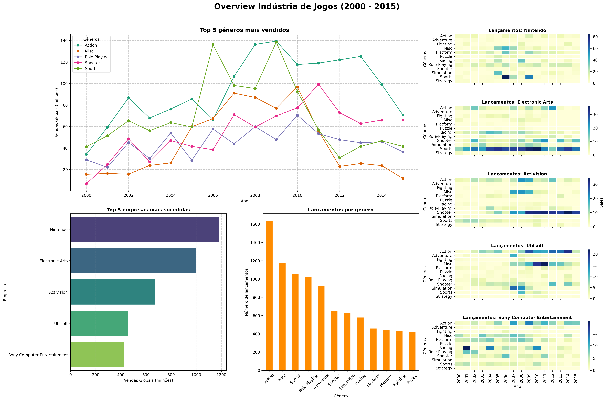

# Relatório
<!-- 
> [!CAUTION]
>
> - Você <ins>**não pode utilizar ferramentas de IA para escrever este relatório**</ins>. -->

## Identificação

- **Nome**: Pedro Henrique Moreira de Andrade Jacinto
- **Cartão UFRGS:** 00587135
## Dados utilizados
<!-- 
> [!IMPORTANT]
>
> - Os dados utilizados devem ser informados como **links** para as fontes originais.
> - Se houver mais de um conjunto de dados, liste todos separadamente.
> - Para cada conjunto de dados, inclua também uma **descrição curta** explicando os dados. -->

1. **Dataset 1**: https://www.kaggle.com/datasets/gregorut/videogamesales
    * **Descrição curta**: Este dataset contem dados sobre vendas de video games entre os anos de 1980 e 2020. Dentre as colunas disponiveis destaca-se 'Genre', 'Publisher' e 'Global Sales'

## Código-fonte da visualização
<!-- 
> [!IMPORTANT]
>
> - Indique abaixo onde está, dentro deste repositório, o código-fonte usado para gerar a visualização. -->

- **Arquivo principal**: [Plots](Visualization_lab3.ipynb)
> OBS: Esse arquivo contém vários plots, além do último gerado para a visualização neste relatório.

## Imagem da visualização gerada

<!-- > [!IMPORTANT]
>
> - Insira aqui uma imagem da visualização criada por você. Troque `imagem-da-visualizacao.png` pelo caminho correto do arquivo no repositório. 
> - Se você criou alguma visualização interativa, então descreva aqui como acessá-la. Por exemplo, se for uma página HTML, coloque o link, ou se for uma visualização 3D, descreva como compilar e executar o código.  -->

## Descrição da visualização

### Legenda (*caption*)

<!-- > [!IMPORTANT]
>
> - Escreva um texto curto explicando como interpretar a visualização. Descreva os elementos visuais, eixos, cores, símbolos ou interações relevantes.
> - Este texto seria a legenda (*caption*) que acompanharia a figura em uma publicação, por exemplo. -->

Temos vários gráficos nesse dashboard. Primeiro temos o gráfico de linhas "Vendas Globais (milhões)", em que temos, nesse intervalo de tempo (eixo X) os gêneros mais vendidos, sendo usado o critério de Vendas Globais (eixo Y). Abaixo dele temos 2 gráficos de barras. O primeiro, "Top 5 empresas mais sucedidas", ordena as 5 maiores empresas, ordenadas de forma decrescente de vendas globais (em milhões). Ao lado, "Lançamentos por gênero" informa o número de lançamentos agrupados por gênero, ordenados também de forma decrescente. Por último temos 5 mapas de calor, cada um diz respeito a uma das empresas mais sucedidas. As cores indicam a quantidade de lucro total (em milhões), separados em um grid com o ano (eixo X) pelo gênero que gerou aquela receita (eixo Y).

### Conclusão demonstrada pela visualização
<!-- 
> [!IMPORTANT]
>
> - Escreva uma conclusão curta sobre os dados com base na visualização.
> - Explique qual insight, padrão ou tendência pode ser observado. -->

Com esse dashboard, podemos concluir algumas estratégias dessas empresas. Peguemos a Activision como exemplo. No início dos anos 2000, para esse dataset, as vendas não iam tão bem. Entretanto, conforme jogos de ação foram se popularizando (2008 - 2010), percebeu-se uma alavancagem em sua receita em um nível capaz de mantê-la como terceiro maior lucro adquirido. Dado esse sucesso, continuou fazendo aquilo que deu certo, jogos de ação, tendo pequenas variações em alguns outros gêneros. 

Podemos ainda falar sobre a dominância do mercado de jogos de esporte por parte da EA (Eletronic Arts). Ao longo de todo período observado, manteve quase que constante uma linha escura no gênero. Esse comportamento não foi muito observado par a Sony. Seu mapa de calor tem valores claros mais espalhados, o que nos informa que lançou diversos jogos de diferentes gêneros.